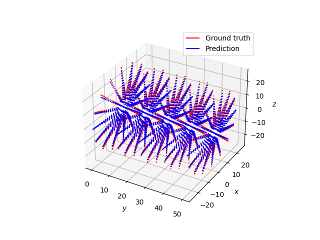
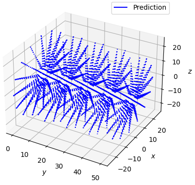
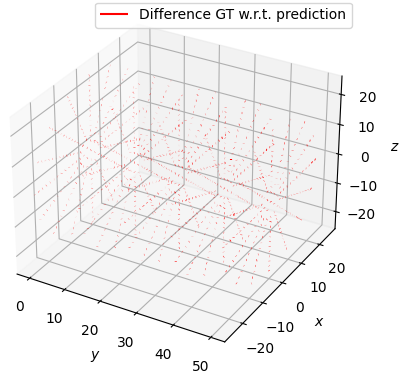

# Surrogate Modelling - AI-Surrogate Tutorial

## Environment setup

Create and activate a virtual environment in your tutorial folder:
```
cd <tutorial_folder>
python -m venv surrogate_venv
source surrogate_venv/bin/activate
```

## Tutorial setup

1. Clone the tutorial in the tutorial folder:
```
cd <tutorial_folder>
git clone https://github.com/ABI-Animus-Laboratory/AI_surrogate_tutorial.git
```
2. Install the tutorial dependencies: 
```
cd <tutorial_folder>/AI_surrogate_tutorial 
pip install -r requirements.txt 
```
3. Test installation
```
cd <tutorial_folder>
source surrogate_venv/bin/activate
PYTHONPATH=. python ./scripts/run_execute_predictions.py ./resources/data_generation_DS_HPC.gen training_data_E1_4.0_E2_4.0_PCA1_0.0_PCA2_0.0.csv
```
If the test is successful, you should see the following three outputs:

   

(If your GPU or CUDA is not compatible with TensorFlow) Deactivate GPU support by delisting your GPU from CUDA devices:
```
export CUDA_VISIBLE_DEVICES=""
```
and TensorFlow will switch to execute purely in CPU.
